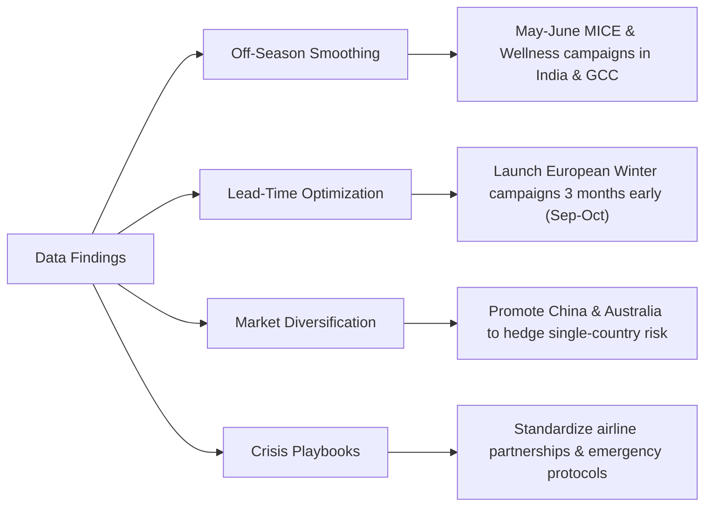

# 📊 Executive Presentation Deck: Sri Lanka Tourism Demand & Recovery (2018–2025)

> **Strategic Insights for Decision-Makers, Destination Marketers, & Hospitality Leaders**  
> *Prepared for: Data & Business Analysis Portfolio*

---

## 🎯 Slide 1: Executive Overview & Macro Problem

### The Challenge
Between 2018 and 2025, Sri Lanka's tourism industry experienced an unprecedented sequence of exogenous shocks:
1. **2019 Security Shock:** Easter Sunday attacks (-18.0% YoY arrival contraction).
2. **2020–2021 Global Pandemic:** COVID-19 border closures, driving arrivals to an all-time trough of **194,495** (an **-91.7%** collapse from 2018).
3. **2022 Domestic Economic Shock:** Severe foreign exchange, power, and fuel disruptions stifled initial border reopening.
4. **2023–2025 Resilient Rebound:** Consecutive growth years (+106.6% in 2023, +38.1% in 2024), culminating in **2,362,521 arrivals in 2025** (a full **101.2% recovery** surpassing pre-crisis records).

| Macro KPI | Pre-Crisis (2018) | Crisis Trough (2021) | Turnaround (2023) | Full Recovery (2025) |
| :--- | :---: | :---: | :---: | :---: |
| **Total Tourist Arrivals** | 2,333,796 | 194,495 | 1,487,303 | **2,362,521** |
| **YoY Performance** | Baseline | -61.7% YoY | +106.6% YoY | **+15.1% YoY** |
| **Recovery Index (vs 2018)** | 100.0% | 8.3% | 63.7% | **101.2%** |

---

## 📉 Slide 2: Crisis Shocks & The Path to Recovery

### Key Analytical Takeaways:
* **Shock Elasticity:** Demand collapsed in rapid step-functions (-18% $\rightarrow$ -73% $\rightarrow$ -62%), demonstrating high vulnerability to security and mobility shocks.
* **V-Shaped Turnaround Velocity:** Once stability was restored in late 2022, recovery occurred at an annualized rate far exceeding global travel averages (+106.6% in 2023).
* **Structural Resilience:** Despite severe multi-year headwinds, the core destination brand equity remained intact, allowing 2025 to establish an all-time arrivals high.

---

## 📅 Slide 3: Seasonality & Demand Swings

### The Seasonality Imbalance:
* **High-Season Peak (Dec – Feb):** Contributes over **4.1 million arrivals** across the analyzed period. Driven by winter escapes from the UK, Germany, Russia, and Scandinavia.
* **Low-Season Monsoon Trough (May – Jun):** Average monthly arrivals decline to **~560K** (a **62% drop** from December's peak of 1.39M).
* **Mid-Year Surge (Jul – Aug):** Notable secondary peak (~900K/month) driven by the Kandy Esala Perahera cultural festival and European summer vacationers.

---

## 🌍 Slide 4: Source Market Concentration & Pareto Exposure

### Concentration & Risk Profile:
* **The Top 5 Markets** (India, United Kingdom, Russia, China, Germany) generate **over 51% of all international tourists**.
* **India is the Anchor Market:** Alone representing **~20% (2.3M cumulative arrivals)**, India serves as the primary stabilizer during European off-peak seasons.
* **Emerging / High-Potential Markets:** Australia (526K), France (515K), and North America show strong resilience and higher average spend per trip.

---

## 🚀 Slide 5: Strategic Business Recommendations

### 1. Off-Peak Demand Smoothing (May–June Monsoon Trough)
* **Action:** Launch dedicated **Wellness, Ayurveda, and MICE (Corporate)** packages targeting short-haul regional markets (India, UAE/GCC, Singapore) where travel lead-times are short (<2 weeks).
* **Expected Impact:** Fill excess hotel capacity and stabilize airline route yields during the annual trough.

### 2. High-Yield Winter Campaign Lead-Time (December–February Peak)
* **Action:** Run promotional campaigns and B2B travel trade roadshows across the UK, Germany, and France **3 months in advance (September–October)**.
* **Expected Impact:** Capture premium early-bird bookings, higher average daily rates (ADR), and longer length-of-stay itineraries.

### 3. Market Diversification & Risk Mitigation
* **Action:** Accelerate targeted campaigns in **Australia, China, and Scandinavia** while adopting seamless local payments (**UPI for Indian travelers**, WeChat Pay/Alipay for Chinese travelers).
* **Expected Impact:** Mitigates single-market economic exposure and lowers friction in booking.

### 4. Dynamic Scenario Planning & Airport Capacity Alignment
* **Action:** Expand expedited immigration checkpoints and transit operations during high-density months (December–March) to avoid gateway bottlenecks as arrivals exceed 2.4M annually.

---
*Generated by Sri Lanka Tourism Analytics Project | Himash Madushanka*
