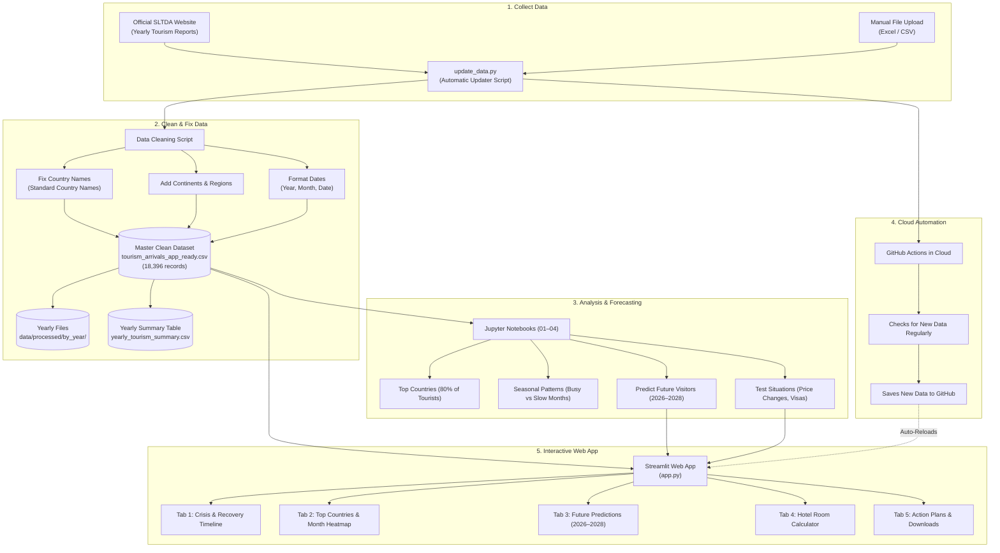

# Sri Lanka Tourism Analytics: Crisis Impact & Growth (2018–2025)

[](https://srilankatourismintelligence.streamlit.app/)
[](https://www.python.org/)
[](https://streamlit.io/)
[](https://pandas.pydata.org/)
[](https://plotly.com/)
[](https://github.com/features/actions)

> 🚀 **Live Interactive Web App:** [https://srilankatourismintelligence.streamlit.app/](https://srilankatourismintelligence.streamlit.app/)
>
> A data project that studies international tourists visiting Sri Lanka from 2018 to 2025. It shows how past crises affected travel, how the country recovered to an all-time record of 2.36 million visitors in 2025, and provides an easy-to-use web dashboard with future predictions and practical plans.

---

## 📌 Executive Summary

Between 2018 and 2025, Sri Lanka experienced major events that affected travel:
1. **2019 Easter Attacks:** Tourist numbers dropped by **18%** right away.
2. **2020–2021 COVID-19 Pandemic:** Travel dropped to a record low of **194,495 tourists in 2021** (down 91.7% compared to 2018).
3. **2022 Economic Crisis:** Fuel and power shortages slowed down recovery.
4. **2023–2025 Strong Recovery:** Tourism bounced back fast, reaching **2,362,521 visitors in 2025** — the highest number in Sri Lanka's history.

---

## 🏗️ Project Architecture & How It Works

Here is how the project collects data, cleans it, and shows it on the web app:



### Simple Overview of Parts

| Part | Tool Used | What It Does | Result |
| :--- | :--- | :--- | :--- |
| **Download Data** | `Requests`, `BeautifulSoup4`, `update_data.py` | Downloads official government reports | Raw data |
| **Clean Data** | `Pandas`, `NumPy`, `country_converter` | Fixes spelling for 200+ country names and adds continents | `tourism_arrivals_app_ready.csv` |
| **Split Data** | Custom Script | Saves data into separate yearly files | `data/processed/by_year/*.csv` |
| **Predictions** | `Statsmodels`, `SciPy` | Estimates visitor arrivals for 2026–2028 | Future predictions |
| **Cloud Updates** | `GitHub Actions` | Checks for new reports in the cloud automatically | Keeps project up to date |
| **Web Dashboard** | `Streamlit`, `Plotly` | Easy interactive web app with charts and filters | Live website on port `8501` |

---

## 🔄 Automatic Data Updates

To keep data up to date without manual work:

```bash
# 1. Check the latest month/year currently in the database
python update_data.py --check

# 2. View and export the year-by-year totals table
python update_data.py --yearly

# 3. Split the master dataset into individual yearly CSV files
python update_data.py --split-years

# 4. Add a newly downloaded report file
python update_data.py --file path_to_report.xlsx
```

### Automatic Cloud Updates (GitHub Actions)
* **How it works:** When the government publishes a new annual report, GitHub Actions runs in the cloud, cleans the new data, and updates the repository automatically with zero manual effort.

---

## 📊 Overview of the Findings


---

## 💡 Practical Recommendations for Hotels & Planners

The data points to four practical actions:

### 1. Bring More Visitors in the Low Season (May–June)
* **The Problem:** Tourist arrivals drop sharply in May and June (down by over 60% compared to December) due to monsoon rains, leaving hotel rooms empty.
* **What to Do:**
  * Promote **wellness, Ayurveda, and business conference deals** to nearby countries like **India, UAE, and Singapore** where flights are short.
  * Partner with airlines (SriLankan Airlines, IndiGo) to offer cheaper off-peak flights and package deals.

### 2. Plan Early for the Busy Winter Season (December–February)
* **The Problem:** December is the busiest month (historically 1.39M total visitors), followed by January and February, as European tourists escape the cold winter.
* **What to Do:**
  * Start digital advertising in the **UK, Germany, and France** early (**September–October, 2 to 3 months ahead**).
  * Prepare hotel staff, transport, and airport immigration counters ahead of the winter rush.

### 3. Attract Visitors from More Countries (Reduce Risk)
* **The Problem:** Over **50% of all tourists come from just 5 countries** (mostly India and the UK). If one country has economic problems, Sri Lanka loses a large share of visitors.
* **What to Do:**
  * Market tours to secondary and growing countries like **Australia, China, and Scandinavian countries**.
  * Allow tourists to pay using popular digital payments (**Indian UPI, Chinese WeChat Pay / Alipay**) at hotels and shops.

### 4. Build Crisis Plans & Manage Capacity
* **The Problem:** Sudden events (pandemics or fuel shortages) can quickly hurt tourism businesses.
* **What to Do:**
  * Create backup operational plans and flexible cancellation rules for hotels.
  * Use arrival predictions to plan airport staffing and avoid long lines during busy weeks.

---

## 🎯 Main Business Goals

| Priority | Main Goal |
|---|---|
| **Balance Travel Seasons** | Smooth out seasonal drops between summer and winter |
| **Grow New Markets** | Attract tourists from new countries to reduce reliance on only a few |
| **Handle Unexpected Drops** | Spot travel drops early and have crisis plans ready |
| **Plan Capacity** | Make sure hotels, transport, and airports have enough capacity for peak months |

---

## 📓 Jupyter Notebooks Breakdown

The analysis is organized across 4 notebooks in the `notebooks/` folder:

| Notebook | Topic | What It Does |
| :--- | :--- | :--- |
| **`01_Data_Loading_and_Integration.ipynb`** | Data Collection | Combines 8 years of raw SLTDA Excel reports into one unified table. |
| **`02_Data_Quality_and_Cleaning.ipynb`** | Data Cleaning | Fixes spelling, cleans empty values, and standardizes over 200 country names. |
| **`03_Descriptive_Statistics.ipynb`** | Basic Statistics | Calculates totals, monthly averages, and seasonal variations. |
| **`04_Overall_Tourism_Performance.ipynb`** | Deep Analysis & Modeling | Analyzes market concentration (80/20 rule), builds forecast models, and tests future scenarios. |

---

## 📂 Project Structure

```
Sri-Lanka-Tourism-Intelligence/
│
├── .github/
│   └── workflows/
│       └── auto_fetch.yml            # Automatic data updater (GitHub Actions)
│
├── .streamlit/
│   └── config.toml                   # Dark theme and server settings
│
├── data/
│   ├── raw/                          # Raw yearly SLTDA Excel files (2018–2025)
│   ├── processed/
│   │   ├── tourism_arrivals_app_ready.csv    # Master cleaned dataset (18,396 rows)
│   │   ├── tourism_arrivals_clean.csv        # Baseline cleaned data
│   │   └── by_year/                          # Individual yearly CSV files (2018–2025)
│   └── reference/                    # Country and continent mapping files
│
├── notebooks/
│   ├── 01_Data_Loading_and_Integration.ipynb
│   ├── 02_Data_Quality_and_Cleaning.ipynb
│   ├── 03_Descriptive_Statistics.ipynb
│   └── 04_Overall_Tourism_Performance.ipynb
│
├── outputs/
│   ├── figures/                      # Generated charts and diagrams
│   │   └── final tourism analysis.png
│   └── tables/                       # Summary data tables
│       ├── final_business_insights.csv
│       └── yearly_tourism_summary.csv
│
├── app.py                            # Interactive Streamlit Web Application
├── update_data.py                    # Script to download and update yearly data
├── EXECUTIVE_SUMMARY.md              # 1-Page Summary Pitch Deck
├── requirements.txt                  # List of Python packages needed
└── README.md                         # Main project documentation
```

---

## 🛠️ Tools & Technologies Used

* **Language:** Python 3.10+
* **Web App:** Streamlit
* **Data Handling:** Pandas, NumPy, OpenPyXL
* **Country Name Standardization:** `country_converter`
* **Charts & Visuals:** Plotly, Matplotlib, Seaborn
* **Time-Series Forecasting:** Statsmodels (SARIMAX), SciPy
* **Automation:** GitHub Actions
* **Web Scraping:** Requests, BeautifulSoup4

---

## 🚀 How to Run the Project Locally

### 1. Clone the repository
```bash
git clone https://github.com/HimashMadushanka/Sri-Lanka-Tourism-Intelligence.git
cd Sri-Lanka-Tourism-Intelligence
```

### 2. Create and activate a virtual environment
```bash
# Windows:
python -m venv .venv
.venv\Scripts\activate

# Mac / Linux:
python3 -m venv .venv
source .venv/bin/activate
```

### 3. Install required packages
```bash
pip install -r requirements.txt
```

### 4. Start the Web App
```bash
streamlit run app.py
```
*Open `http://localhost:8501` in your browser to view the dashboard.*  
*Or open the live website directly at: **[srilankatourismintelligence.streamlit.app](https://srilankatourismintelligence.streamlit.app/)**.*

---

## 👤 Author & Contact

* **Himash Madushanka**
* **Focus:** Data Analytics | Business Intelligence | Data Science
* **🌐 Live Web App:** [srilankatourismintelligence.streamlit.app](https://srilankatourismintelligence.streamlit.app/)
* **GitHub:** [HimashMadushanka/Sri-Lanka-Tourism-Intelligence](https://github.com/HimashMadushanka/Sri-Lanka-Tourism-Intelligence)
