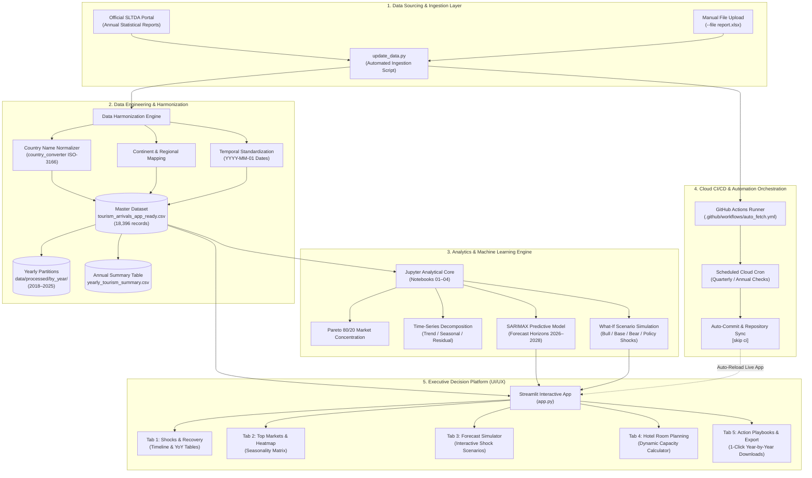
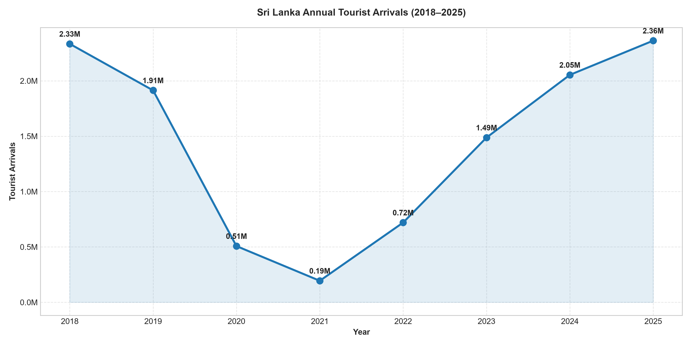
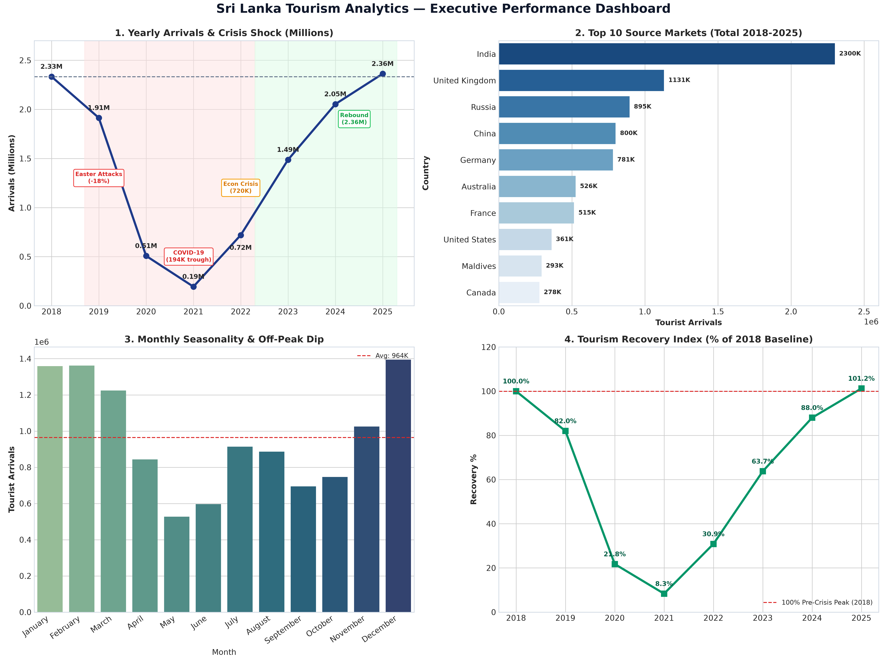
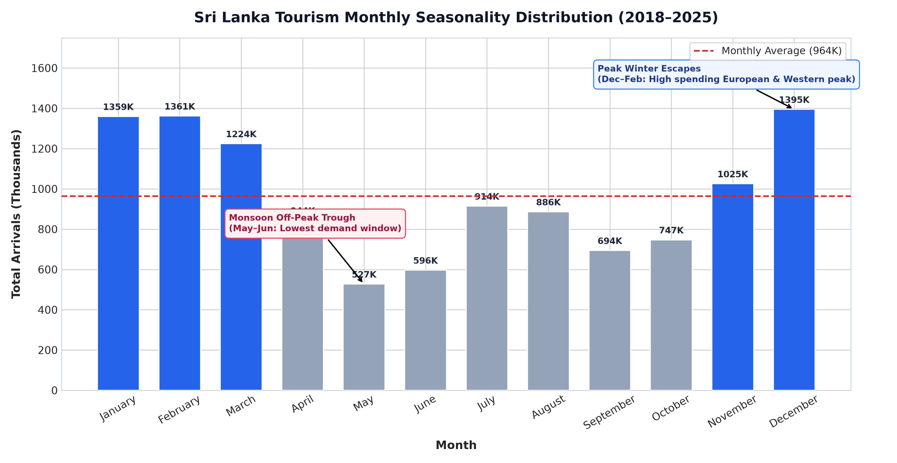
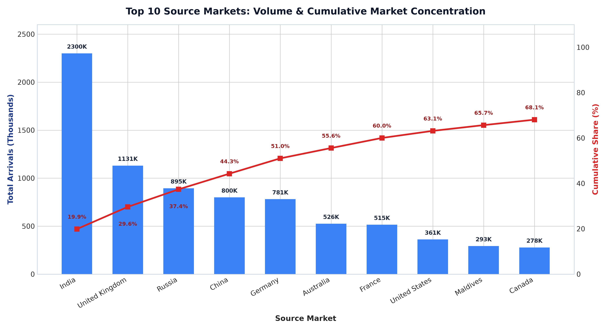

# 🇱🇰 Sri Lanka Tourism Analytics: Demand, Crisis Impact & Strategic Growth (2018–2025)

[](https://srilankatourismintelligence.streamlit.app/)
[](https://www.python.org/)
[](https://streamlit.io/)
[](https://pandas.pydata.org/)
[](https://plotly.com/)
[](https://github.com/features/actions)
[](LICENSE)
[](EXECUTIVE_SUMMARY.md)

> 🚀 **Live Interactive Web App:** [https://srilankatourismintelligence.streamlit.app/](https://srilankatourismintelligence.streamlit.app/)
>
> **An enterprise-grade, end-to-end data analytics and business intelligence platform evaluating Sri Lanka's inbound tourism performance, crisis resilience, seasonal demand dynamics, and source market concentration across 2018–2025. Powered by automated data pipelines and an interactive Streamlit decision platform.**

---

## 📌 Executive Summary *(Recruiter & Decision-Maker Fast Track)*

Between 2018 and 2025, Sri Lanka's tourism industry faced an unprecedented sequence of severe macroeconomic and geopolitical shocks:
1. **2019 Easter Sunday Attacks** (-18.0% immediate drop)
2. **2020–2021 Global COVID-19 Pandemic** (crashing to a historic low of **194,495 arrivals in 2021; -91.7% from 2018 baseline**)
3. **2022 Domestic Economic & Fuel Crisis**
4. **2023–2025 V-Shaped Rebound** culminating in **2,362,521 arrivals in 2025 (101.2% recovery)**, setting a new **all-time national record**.

### 🏆 Macro Performance Benchmark

| Strategic Metric | Baseline (2018) | Crisis Trough (2021) | Mid-Recovery (2023) | Full Rebound (2025) |
| :--- | :---: | :---: | :---: | :---: |
| **Annual International Arrivals** | 2,333,796 | 194,495 | 1,487,303 | **2,362,521** |
| **YoY Arrival Trajectory** | Baseline | -61.7% YoY | +106.6% YoY | **+15.1% YoY** |
| **Recovery Index (vs. 2018 Baseline)** | 100.0% | 8.3% | 63.7% | **101.2% (Record High)** |
| **Dominant Source Market** | India (424K) | India (56K) | India (302K) | **India (531K)** |
| **Peak Arrival Month** | December (253K) | Domestic / Restricted | December (210K) | **December (245K)** |
| **Top 5 Market Concentration** | 48.2% | 58.1% | 54.3% | **51.8%** |

---

## 🏗️ End-to-End System & Pipeline Architecture

The platform follows a modular, decoupled architecture connecting raw public data sources to automated cloud pipelines and executive decision interfaces:



### Architecture Specifications

| Layer | Technology | Primary Function | Output Artifact |
| :--- | :--- | :--- | :--- |
| **Ingestion** | `Requests`, `BeautifulSoup4`, `update_data.py` | Web scraping & schema validation of SLTDA releases | Structured tabular stream |
| **Engineering** | `Pandas`, `NumPy`, `country_converter` | Normalization across 200+ territories & continent assignment | `tourism_arrivals_app_ready.csv` |
| **Data Partitioning** | Custom Partitioning Engine | Auto-splits into individual yearly files | `data/processed/by_year/*.csv` |
| **Modeling** | `Statsmodels`, `SciPy` | SARIMAX time-series forecasting & What-If scenario simulations | Predictive horizon (2026–2028) |
| **CI/CD Orchestration**| `GitHub Actions` | Automated cloud runner with self-committing pipelines | Continuous data synchronization |
| **User Interface** | `Streamlit`, `Plotly Graph Objects` | Modern dark-mode intelligence command center | Browser dashboard on port `8501` |

---

## 🖥️ Interactive Decision Platform (`app.py`)

The platform is designed with an **Executive Dark Mode Theme** featuring **Flame Orange accents (`#f97316`)** and responsive Plotly charts:

```
Streamlit Platform Navigation
├── 🎛️ Dynamic Sidebar Filters
│   ├── Dynamic Period Preset ("All Years", "Crisis Years", "Recovery")
│   ├── Interactive Year Slider (Auto-expands as new years are ingested)
│   ├── Continent & Region Selector
│   ├── Market Mode Radio (All Countries, Top 10, Pick My Own)
│   └── Season & Month Multi-Selector
│
├── 1️⃣ Tab 1: Shocks & Recovery
│   ├── Full-width annotated crisis timeline (Easter Attacks, COVID, Economic Crisis, Rebound)
│   └── Expandable Year-by-Year Summary Table with exact YoY growth rates
│
├── 2️⃣ Tab 2: Top Countries & Seasonality
│   ├── Pareto 80/20 dual-axis chart (Market share % & cumulative distribution)
│   └── Glowing Ember Seasonality Heatmap (Month-by-Country visitor density)
│
├── 3️⃣ Tab 3: Future Forecast & What-If Simulator
│   ├── Multi-year horizon selector (2026, 2027, 2028)
│   ├── Macroeconomic shock testing (Flight price surge, free visa waiver, regional slowdown)
│   ├── Live Prediction Metric card updating in real time
│   └── 3-line fan chart: Expected Forecast, Best Case (+12%), Worst Case (-12%)
│
├── 4️⃣ Tab 4: Hotel Room Planning
│   ├── Length-of-stay slider (5–21 days) & guests per room slider (1.0–2.5 guests)
│   ├── Dynamic metrics: Peak Daily Rooms Needed & Total Annual Room Nights
│   └── Monthly seasonal arrival demand bar chart
│
└── 5️⃣ Tab 5: Decision Center & Automated Exports
    ├── Concrete operational playbooks for hotels, airlines & tourism planners
    ├── 1-Click Year-by-Year Dataset Downloader (Select individual year or all years)
    ├── Annual Totals CSV download button
    └── 1-Page Executive Pitch Deck markdown download button
```

---

## 🔄 Automated Ingestion & Cloud CI/CD Pipeline

To ensure the platform runs permanently on autopilot without manual data entry:

```bash
# 1. Check current latest data status in database
python update_data.py --check

# 2. View & export complete Year-by-Year summary table (with YoY growth)
python update_data.py --yearly

# 3. Split master dataset into individual yearly CSV files in data/processed/by_year/
python update_data.py --split-years

# 4. Ingest any newly downloaded SLTDA Excel or CSV file
python update_data.py --file path_to_report.xlsx
```

### GitHub Actions Cloud Automation
* **Workflow:** [`.github/workflows/auto_fetch.yml`](.github/workflows/auto_fetch.yml)
* **Trigger:** Scheduled cloud runner (quarterly / annual cron) + manual dispatch button.
* **Mechanism:** Checks online SLTDA reports, runs `update_data.py`, detects modifications, and auto-commits updated datasets back to the repository.

---

## 📊 Hero Visualizations Gallery

### 1. Crisis Impact & Recovery Timeline (2018–2025)
*Directly maps macroeconomic shocks, trough levels, and rebound velocity against the 2018 pre-crisis baseline.*



---

### 2. Executive Performance Dashboard (4-Panel Strategic View)
*Cross-sectional analytical breakdown covering crisis trajectories, Pareto market concentration, seasonality curves, and recovery velocity.*



---

### 3. Monthly Seasonality & Off-Peak Demand Swings
*Highlights the critical 62% demand swing between December winter peaks and May–June monsoon troughs.*



---

### 4. Top 10 Source Markets & Cumulative Pareto Concentration
*Demonstrates market concentration where the top 5 countries account for over 51% of all inbound tourists.*



---

## 💡 Actionable Business Recommendations

Rather than generic tourism advice, the data reveals specific operational, pricing, and marketing interventions:

### 1. Off-Peak Demand Smoothing (May–June Monsoon Trough)
* **The Problem:** Total arrivals drop to **~527K in May** and **~596K in June** (a **62% decrease** compared to December), driving hotel vacancy and airline yield drops.
* **Actionable Solution:** 
  * Launch focused **Ayurveda, Wellness, and MICE (Corporate Meetings)** campaigns tailored specifically to short-haul markets (**India, GCC, Singapore**) where flight times are short (<4 hours) and booking lead times are under 14 days.
  * Form joint capacity bundles with regional carriers (SriLankan Airlines, IndiGo, Emirates) offering discounted off-peak seat guarantees linked with luxury hotel stays.

### 2. European Winter Campaign Lead-Time (December–February Peak)
* **The Problem:** December is the highest arrival month (**1.39M historical arrivals**), followed by January and February, driven by high-spending Western European travelers escaping cold winters.
* **Actionable Solution:** 
  * Allocate 55% of the annual digital marketing and trade roadshow budget to the **UK, Germany, and France** during **September–October (90–120 days lead time)**.
  * Target long-stay packages (14+ nights) highlighting cultural round-trips and south-coast beach stays to maximize revenue yield and length-of-stay metrics.

### 3. Source Market Diversification & Risk Mitigation
* **The Problem:** India represents **~20% (2.3M arrivals)** of all visitors, and the top 5 markets represent **over 51%**. This leaves the industry exposed to regional geopolitical or economic fluctuations.
* **Actionable Solution:** 
  * Actively cultivate resilient secondary markets: **Australia (526K), China (800K), and Scandinavia**.
  * Integrate seamless friction-free local payment channels (**UPI for Indian travelers**, **Alipay/WeChat Pay for Chinese travelers**) across hospitality operators to boost in-destination retail and dining expenditure.

### 4. Dynamic Crisis Resilience & Capacity Planning
* **The Problem:** Historical recovery was rapid (+106% in 2023) once external barriers lifted, but strained local power, transportation, and border facilities.
* **Actionable Solution:** 
  * Develop institutional scenario playbooks with flexible cancellation frameworks and guaranteed utility access for hotels during future supply disruptions.
  * Scale e-Visa processing capacity and fast-track automated airport biometric lanes to comfortably handle projected 2.5M+ peak arrival surges without tourist friction.

---

## 📓 Research & Analytics Notebooks

The analytical foundation of this project is organized across 4 modular Jupyter Notebooks in the `notebooks/` directory:

| Notebook | Focus | Key Methods & Deliverables |
| :--- | :--- | :--- |
| **`01_Data_Loading_and_Integration.ipynb`** | Multi-Year Data Wrangling | Automated ingestion of 8 years of SLTDA Excel reports, column harmonization, and schema unification. |
| **`02_Data_Quality_and_Cleaning.ipynb`** | Data Cleaning & Standardization | Anomaly detection, null imputation, zero-handling, and standardizing 200+ regions via `country_converter`. |
| **`03_Descriptive_Statistics.ipynb`** | Statistical Analysis | Summary statistics, skewness/kurtosis, distribution profiles, and seasonal variance metrics. |
| **`04_Overall_Tourism_Performance.ipynb`** | Strategic Analytics & ML Forecasting | Pareto 80/20 analysis, Time-Series Decomposition, SARIMAX forecasting with MAE validation, and What-If scenario simulations. |

---

## 📂 Project Architecture & Directory Structure

```
Sri-Lanka-Tourism-Analytics/
│
├── .github/
│   └── workflows/
│       └── auto_fetch.yml            # Automated cloud CI/CD pipeline (GitHub Actions)
│
├── .streamlit/
│   └── config.toml                   # Dark theme configuration & port settings
│
├── data/
│   ├── raw/                          # Official SLTDA yearly Excel reports (2018–2025)
│   ├── processed/
│   │   ├── tourism_arrivals_app_ready.csv    # Master validated dataset (18,396 rows)
│   │   ├── tourism_arrivals_clean.csv        # Cleaned baseline dataset
│   │   └── by_year/                          # Individual yearly CSV datasets (2018–2025)
│   └── reference/                    # Country mappings and continent definitions
│
├── notebooks/
│   ├── 01_Data_Loading_and_Integration.ipynb
│   ├── 02_Data_Quality_and_Cleaning.ipynb
│   ├── 03_Descriptive_Statistics.ipynb
│   └── 04_Overall_Tourism_Performance.ipynb
│
├── outputs/
│   ├── figures/                      # High-resolution publication figures (300 DPI)
│   │   ├── yearly_tourism_performance.png
│   │   ├── monthly_seasonality.png
│   │   ├── top_source_markets.png
│   │   └── final_tourism_analysis.png
│   └── tables/                       # Automated business summaries
│       ├── final_business_insights.csv
│       └── yearly_tourism_summary.csv
│
├── app.py                            # Streamlit Executive Decision Platform
├── update_data.py                    # Automated SLTDA Ingestion & Year-by-Year Pipeline
├── EXECUTIVE_SUMMARY.md              # 5-Slide Executive Pitch Deck
├── requirements.txt                  # Environment dependencies
├── LICENSE                           # MIT License
└── README.md                         # Primary project documentation
```

---

## 🛠️ Complete Tech Stack

* **Programming Language:** Python 3.10+
* **Dashboard Framework:** Streamlit (v1.40+)
* **Data Engineering & Manipulation:** Pandas (v2.0+), NumPy, OpenPyXL
* **Geographical Entity Normalization:** `country_converter` (ISO-3166 alpha-3 / short name mapping)
* **Data Visualization & Theming:** Plotly Graph Objects, Plotly Express, Seaborn, Matplotlib
* **Statistical Modeling & Forecasting:** SciPy, Statsmodels (SARIMAX, Seasonal Decomposition, CAGR)
* **DevOps & Cloud Automation:** GitHub Actions (Cron scheduling, Git automation)
* **Web Scraping:** Requests, BeautifulSoup4

---

## 🚀 Installation & Quickstart

### 1. Clone the repository
```bash
git clone https://github.com/HimashMadushanka/Sri-Lanka-Tourism-Intelligence.git
cd Sri-Lanka-Tourism-Intelligence
```

### 2. Create and activate a virtual environment
```bash
# Windows (PowerShell):
python -m venv .venv
.venv\Scripts\activate

# macOS / Linux:
python3 -m venv .venv
source .venv/bin/activate
```

### 3. Install dependencies
```bash
pip install -r requirements.txt
```

### 4. Run the Streamlit Dashboard
```bash
streamlit run app.py
```
*Open your browser at `http://localhost:8501` to view locally, or explore the live cloud deployment directly at **[srilankatourismintelligence.streamlit.app](https://srilankatourismintelligence.streamlit.app/)**.*

---

## 👤 Author & Contact

* **Himash Madushanka**
* **Focus:** Data Analytics | Business Intelligence | Decision Science
* **🌐 Live Hosted Platform:** [srilankatourismintelligence.streamlit.app](https://srilankatourismintelligence.streamlit.app/)
* **Executive Pitch Deck:** [View 5-Slide Presentation Deck](EXECUTIVE_SUMMARY.md)
* **GitHub Repository:** [HimashMadushanka/Sri-Lanka-Tourism-Intelligence](https://github.com/HimashMadushanka/Sri-Lanka-Tourism-Intelligence)

---

## 📄 License

This project is licensed under the **MIT License** — see the [LICENSE](LICENSE) file for details.
