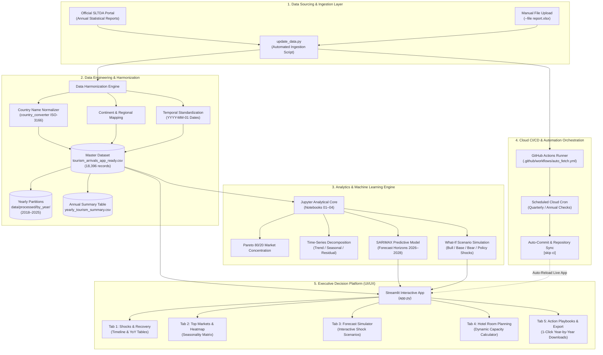

# Sri Lanka Tourism Analytics: Demand, Crisis Impact & Strategic Growth (2018–2025)

[](https://srilankatourismintelligence.streamlit.app/)
[](https://www.python.org/)
[](https://streamlit.io/)
[](https://pandas.pydata.org/)
[](https://plotly.com/)
[](https://github.com/features/actions)
[](LICENSE)
[](EXECUTIVE_SUMMARY.md)


> **An enterprise-grade, end-to-end data analytics and business intelligence platform evaluating Sri Lanka's inbound tourism performance, crisis resilience, seasonal demand dynamics, and source market concentration across 2018–2025. Powered by automated data pipelines and an interactive Streamlit decision platform.**

---

## 📌 Executive Summary 
Between 2018 and 2025, Sri Lanka’s tourism industry faced many serious economic and global challenges:

1. **2019 Easter Sunday Attacks** (-18.0% immediate drop)
2. **2020–2021 Global COVID-19 Pandemic** (crashing to a historic low of **194,495 arrivals in 2021; -91.7% from 2018 baseline**)
3. **2022 Domestic Economic & Fuel Crisis**
4. **2023–2025 V-Shaped Rebound** culminating in **2,362,521 arrivals in 2025 (101.2% recovery)**, setting a new **all-time national record**.

---

## 🏗️ End-to-End System & Pipeline Architecture

The platform follows a modular, decoupled architecture connecting raw public data sources to automated cloud pipelines and executive decision interfaces:



### Architecture Specifications

| Layer | Technology | Primary Function | Output Artifact |
| :--- | :--- | :--- | :--- |
| **Ingestion** | `Requests`, `BeautifulSoup4`, `update_data.py` | Web scraping & schema validation of SLTDA releases | Structured tabular stream |
| **Engineering** | `Pandas`, `NumPy`, `country_converter` | Normalization across 200+ territories & continent assignment | `tourism_arrivals_app_ready.csv` |
| **Data Partitioning** | Custom Partitioning Engine | Auto-splits into individual yearly files | `data/processed/by_year/*.csv` |
| **Modeling** | `Statsmodels`, `SciPy` | SARIMAX time-series forecasting & What-If scenario simulations | Predictive horizon (2026–2028) |
| **CI/CD Orchestration**| `GitHub Actions` | Automated cloud runner with self-committing pipelines | Continuous data synchronization |
| **User Interface** | `Streamlit`, `Plotly Graph Objects` | Modern dark-mode intelligence command center | Browser dashboard on port `8501` |

---


## 🔄 Automated Ingestion & Cloud CI/CD Pipeline

To ensure the platform runs permanently on autopilot without manual data entry:

```bash
# 1. Check current latest data status in database
python update_data.py --check

# 2. View & export complete Year-by-Year summary table (with YoY growth)
python update_data.py --yearly

# 3. Split master dataset into individual yearly CSV files in data/processed/by_year/
python update_data.py --split-years

# 4. Ingest any newly downloaded SLTDA Excel or CSV file
python update_data.py --file path_to_report.xlsx
```

### GitHub Actions Cloud Automation
* **Workflow:** [`.github/workflows/auto_fetch.yml`](.github/workflows/auto_fetch.yml)
* **Trigger:** Scheduled cloud runner (quarterly / annual cron) + manual dispatch button.
* **Mechanism:** Checks online SLTDA reports, runs `update_data.py`, detects modifications, and auto-commits updated datasets back to the repository.

---

## 📊 Hero Visualizations Gallery


---

# 📌 Actionable Business Recommendations

The analysis gives **simple and practical ideas** for tourism planning, marketing, and business decisions.

## 1.  Increase Tourism During May–June

**Business Issue:**  
May and June usually have fewer tourists than the busiest months.

### Recommended Actions

- **Seasonal Campaigns:** Promote wellness, Ayurveda, MICE, and other suitable activities.
- **Target Markets:** Focus on nearby countries and markets where short trips are easier.
- **Travel Packages:** Encourage airlines, hotels, and tour operators to offer special packages.
- **Use Capacity Better:** Use discounts and promotions to increase hotel and tourism-service usage.

---

## 2.  Prepare for the December–February Peak

**Business Issue:**  
December to February is a strong tourism period.

### Recommended Actions

- **Start Marketing Early:** Begin promotions several months before the peak season.
- **Focus on Major Markets:** Give more attention to markets such as the UK, Germany, and France.
- **Promote Popular Experiences:** Promote beaches, culture, wildlife, wellness, and long-stay holidays.
- **Prepare Capacity:** Plan hotels, transport, airports, and tourism services before demand increases.

---

## 3.  Diversify Tourist Source Markets

**Business Issue:**  
Sri Lanka depends heavily on a limited number of tourist markets. This creates risk when those markets face problems.

### Recommended Actions

- **Find New Markets:** Keep strong existing markets while developing new ones.
- **Choose Priority Markets:** Look at market size, growth, recovery, and stability.
- **Use Localized Marketing:** Create different campaigns for different countries.
- **Improve Digital Payments:** Provide convenient local and international payment options for tourists.

---

## 4.  Improve Crisis Planning

**Business Issue:**  
The 2019–2022 period showed that major problems can strongly affect tourism.

### Recommended Actions

- **Create Crisis Plans:** Prepare clear plans for health crises, economic problems, transport issues, and sudden drops in demand.
- **Early Warning System:** Monitor tourist arrivals and quickly identify unusual declines.
- **Plan Infrastructure:** Use tourism trends to plan airports, transport, hotels, and other services.
- **Stay Flexible:** Use flexible booking, cancellation, and capacity policies during uncertain periods.
- **Monitor Recovery:** Regularly check how quickly different tourist markets are recovering.


## Strategic Business Priorities


Based on the analysis, the tourism sector should focus on **four main areas**:

| Priority | Simple Objective |
|---|---|
| **Demand Management** | Reduce big changes in tourist demand |
| **Market Development** | Strengthen current markets and find new markets |
| **Risk Management** | Find tourism problems early and respond quickly |
| **Capacity Planning** | Prepare hotels, transport, and other services for expected tourists |
---

## 📓 Research & Analytics Notebooks


The main analysis of this project is divided into **4 Jupyter Notebooks** in the `notebooks/` folder:

| Notebook | Focus | Main Work |
|---|---|---|
| **`01_Data_Loading_and_Integration.ipynb`** | Data Loading | Load 8 years of SLTDA Excel files and combine the data |
| **`02_Data_Quality_and_Cleaning.ipynb`** | Data Cleaning | Find data problems, handle missing values and zeros, and standardize country names |
| **`03_Descriptive_Statistics.ipynb`** | Statistical Analysis | Calculate basic statistics and study tourism patterns and seasonal changes |
| **`04_Overall_Tourism_Performance.ipynb`** | Tourism Analysis & Forecasting | Find important markets, study trends, forecast future arrivals, and test different scenarios |

---

## 📂 Project Architecture & Directory Structure

```
Sri-Lanka-Tourism-Analytics/
│
├── .github/
│   └── workflows/
│       └── auto_fetch.yml            
│
├── .streamlit/
│   └── config.toml                   
│
├── data/
│   ├── raw/                          
│   ├── processed/
│   │   ├── tourism_arrivals_app_ready.csv    
│   │   ├── tourism_arrivals_clean.csv        
│   │   └── by_year/                          
│   └── reference/                    

├── notebooks/
│   ├── 01_Data_Loading_and_Integration.ipynb
│   ├── 02_Data_Quality_and_Cleaning.ipynb
│   ├── 03_Descriptive_Statistics.ipynb
│   └── 04_Overall_Tourism_Performance.ipynb
│
├── outputs/
│   ├── figures/                      
│   │   ├── yearly_tourism_performance.png
│   │   ├── monthly_seasonality.png
│   │   ├── top_source_markets.png
│   │   └── final_tourism_analysis.png
│   └── tables/                       
│       ├── final_business_insights.csv
│       └── yearly_tourism_summary.csv
│
├── .venv
├── tests
├── app.py                            
├── update_data.py                                 
├── requirements.txt  
├── .gitignore                                  
└── README.md                        
```
---

## 🛠️ Complete Tech Stack

* **Programming Language:** Python 3.10+
* **Dashboard Framework:** Streamlit (v1.40+)
* **Data Engineering & Manipulation:** Pandas (v2.0+), NumPy, OpenPyXL
* **Geographical Entity Normalization:** `country_converter` (ISO-3166 alpha-3 / short name mapping)
* **Data Visualization & Theming:** Plotly Graph Objects, Plotly Express, Seaborn, Matplotlib
* **Statistical Modeling & Forecasting:** SciPy, Statsmodels (SARIMAX, Seasonal Decomposition, CAGR)
* **DevOps & Cloud Automation:** GitHub Actions (Cron scheduling, Git automation)
* **Web Scraping:** Requests, BeautifulSoup4

---


## 🚀 Installation & Quickstart

### 1. Clone the repository
```bash
git clone https://github.com/HimashMadushanka/Sri-Lanka-Tourism-Intelligence.git
cd Sri-Lanka-Tourism-Intelligence
```

### 2. Create and activate a virtual environment
```bash
python -m venv .venv
.venv\Scripts\activate

python3 -m venv .venv
source .venv/bin/activate
```

### 3. Install dependencies
```bash
pip install -r requirements.txt
```

### 4. Run the Streamlit Dashboard
```bash
streamlit run app.py
```
*Open your browser at `http://localhost:8501` to view locally, or explore the live cloud deployment directly at **[srilankatourismintelligence.streamlit.app](https://srilankatourismintelligence.streamlit.app/)**.*

---

## 👤 Author & Contact

* **Himash Madushanka**
* **Focus:** Data Analytics | Business Intelligence | Data Science
* **🌐 Live Hosted Platform:** [srilankatourismintelligence.streamlit.app](https://srilankatourismintelligence.streamlit.app/)
* **GitHub Repository:** [HimashMadushanka/Sri-Lanka-Tourism-Intelligence](https://github.com/HimashMadushanka/Sri-Lanka-Tourism-Intelligence)

---

