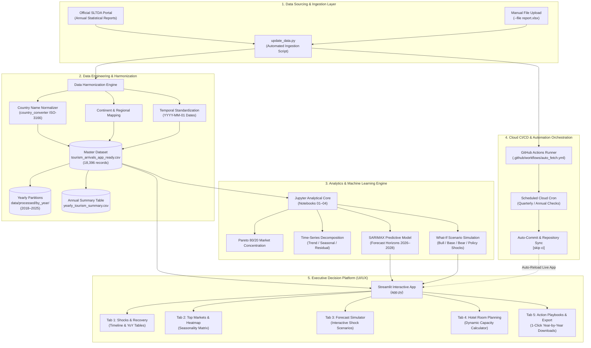

# Sri Lanka Tourism Analytics: Demand, Crisis Impact & Strategic Growth (2018–2025)

[](https://srilankatourismintelligence.streamlit.app/)
[](https://www.python.org/)
[](https://streamlit.io/)
[](https://pandas.pydata.org/)
[](https://plotly.com/)
[](https://github.com/features/actions)
[](LICENSE)
[](EXECUTIVE_SUMMARY.md)


> **An enterprise-grade, end-to-end data analytics and business intelligence platform evaluating Sri Lanka's inbound tourism performance, crisis resilience, seasonal demand dynamics, and source market concentration across 2018–2025. Powered by automated data pipelines and an interactive Streamlit decision platform.**

---

## 📌 Executive Summary *(Recruiter & Decision-Maker Fast Track)*

Between 2018 and 2025, Sri Lanka's tourism industry faced an unprecedented sequence of severe macroeconomic and geopolitical shocks:
1. **2019 Easter Sunday Attacks** (-18.0% immediate drop)
2. **2020–2021 Global COVID-19 Pandemic** (crashing to a historic low of **194,495 arrivals in 2021; -91.7% from 2018 baseline**)
3. **2022 Domestic Economic & Fuel Crisis**
4. **2023–2025 V-Shaped Rebound** culminating in **2,362,521 arrivals in 2025 (101.2% recovery)**, setting a new **all-time national record**.

---

## 🏗️ End-to-End System & Pipeline Architecture

The platform follows a modular, decoupled architecture connecting raw public data sources to automated cloud pipelines and executive decision interfaces:



### Architecture Specifications

| Layer | Technology | Primary Function | Output Artifact |
| :--- | :--- | :--- | :--- |
| **Ingestion** | `Requests`, `BeautifulSoup4`, `update_data.py` | Web scraping & schema validation of SLTDA releases | Structured tabular stream |
| **Engineering** | `Pandas`, `NumPy`, `country_converter` | Normalization across 200+ territories & continent assignment | `tourism_arrivals_app_ready.csv` |
| **Data Partitioning** | Custom Partitioning Engine | Auto-splits into individual yearly files | `data/processed/by_year/*.csv` |
| **Modeling** | `Statsmodels`, `SciPy` | SARIMAX time-series forecasting & What-If scenario simulations | Predictive horizon (2026–2028) |
| **CI/CD Orchestration**| `GitHub Actions` | Automated cloud runner with self-committing pipelines | Continuous data synchronization |
| **User Interface** | `Streamlit`, `Plotly Graph Objects` | Modern dark-mode intelligence command center | Browser dashboard on port `8501` |

---


## 🔄 Automated Ingestion & Cloud CI/CD Pipeline

To ensure the platform runs permanently on autopilot without manual data entry:

```bash
# 1. Check current latest data status in database
python update_data.py --check

# 2. View & export complete Year-by-Year summary table (with YoY growth)
python update_data.py --yearly

# 3. Split master dataset into individual yearly CSV files in data/processed/by_year/
python update_data.py --split-years

# 4. Ingest any newly downloaded SLTDA Excel or CSV file
python update_data.py --file path_to_report.xlsx
```

### GitHub Actions Cloud Automation
* **Workflow:** [`.github/workflows/auto_fetch.yml`](.github/workflows/auto_fetch.yml)
* **Trigger:** Scheduled cloud runner (quarterly / annual cron) + manual dispatch button.
* **Mechanism:** Checks online SLTDA reports, runs `update_data.py`, detects modifications, and auto-commits updated datasets back to the repository.

---

## 📊 Hero Visualizations Gallery


---
## 📌 Actionable Business Recommendations

The analysis translates tourism data into practical recommendations for tourism planning, marketing, market development, and operational decision-making.

### 1.Off-Peak Demand Smoothing — May–June

**Business Issue:**  
May and June generally represent lower-demand periods compared with the strongest tourism months.

**Recommended Actions:**

- **Tactical Campaigns:** Launch targeted seasonal campaigns focused on wellness, Ayurveda, MICE (Meetings, Incentives, Conferences and Exhibitions), and other suitable tourism experiences during lower-demand periods.
- **Target Markets:** Prioritize regional and short-haul source markets where travel accessibility can support short-term demand generation.
- **Partnership Incentives:** Explore partnerships between airlines, hotels, and tourism operators to develop attractive off-peak travel packages.
- **Capacity Optimization:** Use lower-demand periods for targeted promotions and capacity utilization strategies.

---

### 2.High-Yield Winter Campaign Planning — December–February

**Business Issue:**  
December–February represents a strong tourism demand period, creating an opportunity for advance marketing and capacity planning.

**Recommended Actions:**

- **Early Marketing:** Begin digital marketing and international trade promotion several months before the peak season.
- **Priority Markets:** Focus promotional activities on major European source markets such as the UK, Germany, and France where appropriate.
- **Value Proposition:** Promote cultural tourism, wildlife experiences, beach holidays, wellness tourism, and long-stay packages.
- **Capacity Planning:** Prepare accommodation, transport, airport, and tourism-service capacity ahead of expected peak demand.

---

### 3.Source Market Diversification & Risk Mitigation

**Business Issue:**  
A significant proportion of tourist arrivals is concentrated in a limited number of source markets. High market concentration can increase exposure to economic, geopolitical, or travel-related disruptions.

**Recommended Actions:**

- **Reduce Market Concentration:** Continue strengthening established markets while developing high-potential secondary and emerging markets.
- **Market Prioritization:** Use market size, growth rate, recovery performance, and consistency to identify priority markets.
- **Localized Marketing:** Develop market-specific tourism campaigns based on visitor behavior and seasonal demand.
- **Digital Payment Readiness:** Evaluate suitable local and international digital payment options to improve visitor convenience and support tourism spending.

---

### 4.Dynamic Crisis Resilience & Capacity Planning

**Business Issue:**  
The 2019–2022 period demonstrated how external shocks can significantly affect tourism demand and operational capacity.

**Recommended Actions:**

- **Scenario Playbooks:** Develop predefined operational responses for major tourism disruptions such as health crises, economic disruptions, transportation problems, or sudden demand changes.
- **Early Warning System:** Monitor tourist arrivals against historical and expected levels to identify unusual declines at an early stage.
- **Infrastructure Alignment:** Use historical and forecast demand patterns to support airport, transportation, accommodation, and tourism-service capacity planning.
- **Flexible Operations:** Encourage flexible booking, cancellation, and capacity-management strategies during periods of uncertainty.
- **Recovery Monitoring:** Track source-market recovery and overall tourism performance continuously after major disruptions.

---

## Strategic Business Priorities

Based on the analytical framework, the tourism sector should focus on four key priorities:

| Priority | Objective |
|---|---|
| **Demand Management** | Reduce excessive seasonal fluctuations |
| **Market Development** | Strengthen existing markets and develop emerging markets |
| **Risk Management** | Detect and respond to tourism demand disruptions |
| **Capacity Planning** | Align tourism infrastructure and services with expected demand |


---

## 📓 Research & Analytics Notebooks

The analytical foundation of this project is organized across 4 modular Jupyter Notebooks in the `notebooks/` directory:

| Notebook | Focus | Key Methods & Deliverables |
| :--- | :--- | :--- |
| **`01_Data_Loading_and_Integration.ipynb`** | Multi-Year Data Wrangling | Automated ingestion of 8 years of SLTDA Excel reports, column harmonization, and schema unification. |
| **`02_Data_Quality_and_Cleaning.ipynb`** | Data Cleaning & Standardization | Anomaly detection, null imputation, zero-handling, and standardizing 200+ regions via `country_converter`. |
| **`03_Descriptive_Statistics.ipynb`** | Statistical Analysis | Summary statistics, skewness/kurtosis, distribution profiles, and seasonal variance metrics. |
| **`04_Overall_Tourism_Performance.ipynb`** | Strategic Analytics & ML Forecasting | Pareto 80/20 analysis, Time-Series Decomposition, SARIMAX forecasting with MAE validation, and What-If scenario simulations. |

---

## 📂 Project Architecture & Directory Structure

```
Sri-Lanka-Tourism-Analytics/
│
├── .github/
│   └── workflows/
│       └── auto_fetch.yml            # Automated cloud CI/CD pipeline (GitHub Actions)
│
├── .streamlit/
│   └── config.toml                   # Dark theme configuration & port settings
│
├── data/
│   ├── raw/                          # Official SLTDA yearly Excel reports (2018–2025)
│   ├── processed/
│   │   ├── tourism_arrivals_app_ready.csv    # Master validated dataset (18,396 rows)
│   │   ├── tourism_arrivals_clean.csv        # Cleaned baseline dataset
│   │   └── by_year/                          # Individual yearly CSV datasets (2018–2025)
│   └── reference/                    # Country mappings and continent definitions
│
├── notebooks/
│   ├── 01_Data_Loading_and_Integration.ipynb
│   ├── 02_Data_Quality_and_Cleaning.ipynb
│   ├── 03_Descriptive_Statistics.ipynb
│   └── 04_Overall_Tourism_Performance.ipynb
│
├── outputs/
│   ├── figures/                      # High-resolution publication figures (300 DPI)
│   │   ├── yearly_tourism_performance.png
│   │   ├── monthly_seasonality.png
│   │   ├── top_source_markets.png
│   │   └── final_tourism_analysis.png
│   └── tables/                       # Automated business summaries
│       ├── final_business_insights.csv
│       └── yearly_tourism_summary.csv
│
├── app.py                            # Streamlit Executive Decision Platform
├── update_data.py                    # Automated SLTDA Ingestion & Year-by-Year Pipeline
├── EXECUTIVE_SUMMARY.md              # 5-Slide Executive Pitch Deck
├── requirements.txt                  # Environment dependencies
├── LICENSE                           # MIT License
└── README.md                         # Primary project documentation
```

---

## 🛠️ Complete Tech Stack

* **Programming Language:** Python 3.10+
* **Dashboard Framework:** Streamlit (v1.40+)
* **Data Engineering & Manipulation:** Pandas (v2.0+), NumPy, OpenPyXL
* **Geographical Entity Normalization:** `country_converter` (ISO-3166 alpha-3 / short name mapping)
* **Data Visualization & Theming:** Plotly Graph Objects, Plotly Express, Seaborn, Matplotlib
* **Statistical Modeling & Forecasting:** SciPy, Statsmodels (SARIMAX, Seasonal Decomposition, CAGR)
* **DevOps & Cloud Automation:** GitHub Actions (Cron scheduling, Git automation)
* **Web Scraping:** Requests, BeautifulSoup4

---

## 🚀 Installation & Quickstart

### 1. Clone the repository
```bash
git clone https://github.com/HimashMadushanka/Sri-Lanka-Tourism-Intelligence.git
cd Sri-Lanka-Tourism-Intelligence
```

### 2. Create and activate a virtual environment
```bash
# Windows (PowerShell):
python -m venv .venv
.venv\Scripts\activate

# macOS / Linux:
python3 -m venv .venv
source .venv/bin/activate
```

### 3. Install dependencies
```bash
pip install -r requirements.txt
```

### 4. Run the Streamlit Dashboard
```bash
streamlit run app.py
```
*Open your browser at `http://localhost:8501` to view locally, or explore the live cloud deployment directly at **[srilankatourismintelligence.streamlit.app](https://srilankatourismintelligence.streamlit.app/)**.*

---

## 👤 Author & Contact

* **Himash Madushanka**
* **Focus:** Data Analytics | Business Intelligence | Data Science
* **🌐 Live Hosted Platform:** [srilankatourismintelligence.streamlit.app](https://srilankatourismintelligence.streamlit.app/)
* **GitHub Repository:** [HimashMadushanka/Sri-Lanka-Tourism-Intelligence](https://github.com/HimashMadushanka/Sri-Lanka-Tourism-Intelligence)

---

