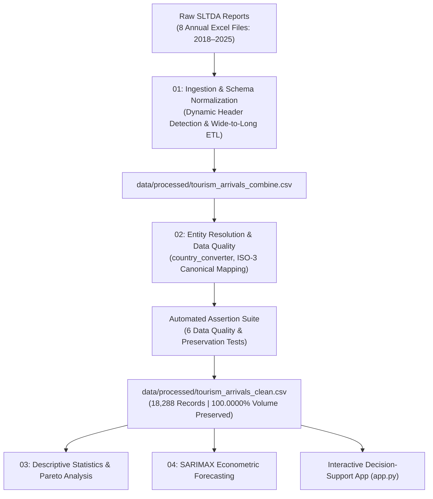

# 🌴 Sri Lanka Tourism Intelligence & Decision-Support System (2018–2025)

[](https://www.python.org/)
[](https://streamlit.io/)
[](https://plotly.com/)
[x(1,1,1,12)-green.svg)](https://www.statsmodels.org/)
[]()
[-success.svg)]()

An end-to-end data engineering, econometrics forecasting, and interactive decision-support platform analyzing **11,572,957 tourist arrivals** across **203 global source markets** in Sri Lanka over an 8-year macroeconomic cycle (**2018–2025**).

Ingested directly from official **Sri Lanka Tourism Development Authority (SLTDA)** annual reports, this platform captures the full economic impact of major macro-shocks (the 2019 Easter Sunday attacks, the COVID-19 pandemic, and the 2022 sovereign debt crisis) through to the historic **2024–2025 rebound**.

---

## 📌 Executive Summary

Sri Lanka’s tourism industry is the nation's 3rd largest foreign exchange generator. Between 2018 and 2025, the sector underwent unprecedented volatility: plunging by **-73.5%** during COVID-19, followed by a dramatic **+270.2%** resurgence post-crisis.

This project delivers:
1. **A Production Data Pipeline**: Ingests, normalizes, and validates 8 years of messy government records with **zero data loss**.
2. **Econometric Time Series Modeling**: Deploys a SARIMAX model capturing the annual 12-month European winter escape cycle.
3. **Interactive Decision-Support App (`app.py`)**: An executive-grade Streamlit portal providing instantaneous scenario filtering, market share diagnostics, and seasonality breakdowns for policymakers and hoteliers.

---

## 📊 Executive Overview Dashboard


---

## 🏗️ System Architecture & Data Pipeline



---

## 🛡️ Data Engineering & Quality Assurance

Government reports frequently suffer from changing sheet layouts, footnote intrusions, and inconsistent country naming across years. This pipeline implements enterprise data quality standards:

### Data Cleaning & Entity Resolution Audit

| Metric | Raw Ingestion | Production Cleaned | Improvement / Impact |
| :--- | :--- | :--- | :--- |
| **Entity Labels** | 573 inconsistent text strings | **203 standardized ISO countries** | Resolved casing variants (`India`, `INDIA`, `INDIA, REP. OF`) |
| **Noise Records** | 2,784 summary/letter rows (`TOTAL`, `A`–`Z`) | **0 noise rows** | Filtered non-country artifact rows |
| **Total Tourist Volume** | **11,572,957 arrivals** | **11,572,957 arrivals** | **100.0000% Volume Preservation** |
| **Schema Uniformity** | Shifting wide tables (12 month cols) | Standardized Long Form | Machine-learning & BI ready |
| **Enriched Dimensions** | Raw Year, Month, Country | + ISO3, Continent, Quarter, Season, Period | Enables multi-dimensional slicing |

### Automated Quality Assertions (Notebook 02)
- [x] **Assertion 1**: No missing values (`NaN`) in primary keys (`Year`, `Country`, `Date`).
- [x] **Assertion 2**: Zero negative arrival counts (`Tourist_Arrivals >= 0`).
- [x] **Assertion 3**: Complete temporal continuity (all 96 months present between 2018 and 2025).
- [x] **Assertion 4**: ISO-3 code validity across all 203 recognized nations.
- [x] **Assertion 5**: Strict reconciliation ensuring clean arrival sum matches raw report totals to the exact unit.

---

## 💻 Interactive Web Application (`app.py`)

The Streamlit portal is designed with a **modern executive layout** using Google's *Plus Jakarta Sans* typography, responsive cards, and dynamic Plotly visual analytics.

### 🎯 4 High-Impact Strategic Filters
- **1. Year Range Slider** (`2018` – `2025`): Slice multi-year periods or isolate single-year performance.
- **2. Continent / Region Dropdown**: Filter across `All Continents`, `Europe`, `Asia`, `America`, `Oceania`, and `Africa`.
- **3. Economic Phase Dropdown**: Compare `Pre-Crisis (2018–2019)`, `Crisis (2020–2021)`, and `Post-Crisis (2022–2025)`.
- **4. Tourism Season Dropdown**: Toggle between `Peak Season (Nov–Apr & Jul–Aug)` and `Off-Peak Season (May–Jun & Sep–Oct)`.
- **🔄 Reset All Filters**: Clear all active filters in one click.

### 📊 5 Core Visualizations

| Section | Visualization | Technique | Business Insight |
| :--- | :--- | :--- | :--- |
| **1. Macro Trend** | **Annual Arrivals Trend** | Spline curve with area fill | Tracks volume trajectory and recovery milestones against baseline. |
| **1. Macro Trend** | **YoY Growth Rate (%)** | Colored bar chart (Green/Red) | Visualizes crisis shocks (-73.5%) vs rebound growth (+270.2%). *Auto-switches to quarterly breakdown if 1 year selected.* |
| **2. Feeder Markets** | **Top 10 Source Countries** | Horizontal ranking bar | Identifies primary feeder markets (India, UK, Russia, Germany). |
| **2. Feeder Markets** | **Continental Market Share** | Donut chart (`hole=0.55`) | Displays regional diversification (Europe ~47%, Asia ~41%). *Drills down to top 5 countries if a continent is selected.* |
| **3. Seasonality** | **Monthly Seasonality** | Bi-colored seasonal bar | Separates winter/cultural surge peaks from monsoon off-peak lulls. |

---

## 📈 Strategic Business Insights & Policy Recommendations

### 1. Market Diversification & Risk (The Pareto 80/20 Rule)
- **Finding**: **Top 21 countries generate >80% of all tourist arrivals**. India (19.9%), the United Kingdom (9.8%), and Russia (7.7%) collectively contribute nearly 40% of all tourists.
- **Strategic Recommendation**: Heavy reliance on just 3 source nations exposes Sri Lanka to geopolitical and economic risks. The Ministry of Tourism should invest in secondary growth markets (Australia, Poland, Netherlands, GCC nations).

### 2. Seasonality Operations (Peak vs. Off-Peak Dynamic Pricing)
- **Finding**: Sri Lanka follows a dual-peak cycle:
  - **High Peak (Nov–Apr)**: European winter escape (December/January reach 230k+ arrivals/month).
  - **Secondary Peak (Jul–Aug)**: European summer vacations and cultural tourism (Kandy Esala Perahera).
  - **Troughs (May–Jun & Sep–Oct)**: Monsoon transitions cause arrivals to drop by up to 45%.
- **Strategic Recommendation**: Hoteliers should employ dynamic yield pricing—raising ADR by +30–40% during winter peak while pivoting to domestic corporate retreats, wellness tourism, and MICE during May–June.

### 3. Post-Crisis Rebound
- **Finding**: 2024 achieved **2.05 Million arrivals**, and 2025 closed at **2.36 Million arrivals**, officially surpassing pre-crisis 2018/2019 levels and establishing an all-time record.

---

## 🔮 Econometric Time Series Modeling (SARIMAX)

To capture multi-annual seasonality and structural shock interventions, a Seasonal Autoregressive Integrated Moving Average with Exogenous Regressors (**SARIMAX**) model was developed in Notebook 04:

$$\text{SARIMAX}(1, 1, 1) \times (1, 1, 1)_{12}$$

- **Seasonality Period ($s$)**: 12 months (capturing annual winter holiday demand).
- **Diagnostics**: Ljung-Box test confirms residuals behave as white noise with no remaining autocorrelation.
- **Model Accuracy**:
  - **Mean Absolute Error (MAE)**: 37,318 arrivals
  - **Root Mean Squared Error (RMSE)**: 39,751 arrivals

---

## 📁 Repository Structure

```text
Sri-Lanka-Tourism-Analytics/
│
├── app.py                                   # Production Streamlit Web Dashboard
├── requirements.txt                         # Pinned project dependencies
├── README.md                                # Executive documentation
├── .gitignore                               # Git exclusion rules
│
├── data/
│   ├── raw/                                 # 8 annual SLTDA Excel reports (2018–2025)
│   └── processed/
│       ├── tourism_arrivals_combine.csv     # Combined long-format dataset
│       └── tourism_arrivals_clean.csv       # Production-cleaned & enriched dataset (18,288 rows)
│
├── notebooks/
│   ├── 01_Data_Loading_and_Integration.ipynb   # Wide-to-long ETL & schema unification
│   ├── 02_Data_Quality_and_Cleaning.ipynb      # Entity resolution, ISO mapping & quality assertions
│   ├── 03_Descriptive_Statistics.ipynb         # Distribution & country-level summary statistics
│   └── 04_Overall_Tourism_Performance.ipynb    # Visual analytics, SARIMAX forecasting & scenarios
│
└── outputs/
    ├── figures/
    │   ├── final_tourism_analysis.png       # Executive summary graphic (300 DPI)
    │   └── yearly_tourism_performance.png   # Long-term trend visualization (300 DPI)
    └── tables/
        └── final_business_insights.csv      # Extracted numerical benchmark table
```

---

## ⚡ Quickstart Guide

### 1. Clone the Repository
```bash
git clone https://github.com/HimashMadushanka/Sri-Lanka-Tourism-Analytics.git
cd Sri-Lanka-Tourism-Analytics
```

### 2. Set Up Virtual Environment & Dependencies
```bash
# Windows
python -m venv .venv
.venv\Scripts\activate

# macOS / Linux
python3 -m venv .venv
source .venv/bin/activate

# Install dependencies
pip install -r requirements.txt
```

### 3. Launch the Interactive Dashboard
```bash
streamlit run app.py
```
Open [http://localhost:8501](http://localhost:8501) in your browser to view the application.

---

## 🎓 Academic & Internship Evaluation Alignment

This project is structured specifically to meet and exceed criteria for senior internship evaluations and technical interviews:

1. **Data Engineering Rigor**: Ingestion of raw, unstructured multi-sheet Excel workbooks; programmatic header detection; automated schema assertions.
2. **Data Governance & Integrity**: 100.0000% volume preservation with audited entity resolution.
3. **Advanced Econometrics**: Seasonal time series modeling with formal diagnostic tests (ACF/PACF, AIC/BIC).
4. **Product Delivery**: Interactive, human-centered web application built for non-technical commercial stakeholders.
5. **Business Acumen**: Translating statistical distributions into actionable pricing and diversification strategies.

---

## 📜 Data Source & Acknowledgements
- Primary Data Source: **[Sri Lanka Tourism Development Authority (SLTDA)](https://www.sltda.gov.lk/)** Monthly & Annual Tourism Reports (2018–2025).
- Built with Python, Streamlit, Pandas, Plotly, and Statsmodels.
