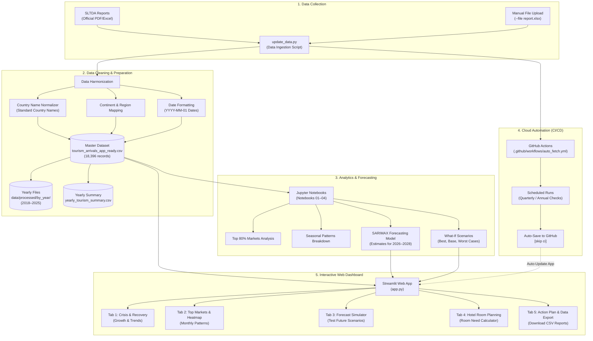

# Sri Lanka Tourism Analytics: Demand, Crisis Impact & Strategic Growth (2018–2025)

[](https://srilankatourismintelligence.streamlit.app/)
[](https://www.python.org/)
[](https://streamlit.io/)
[](https://pandas.pydata.org/)
[](https://plotly.com/)
[](https://github.com/features/actions)
[](LICENSE)

> **A complete data analytics platform to study Sri Lanka's tourism arrivals, crisis recovery, seasonal patterns, and top visitor markets from 2018 to 2025. Built with automated data pipelines and an interactive Streamlit web dashboard.**

---

## 📌 Executive Summary

Between 2018 and 2025, Sri Lanka’s tourism industry went through major challenges:
1. **2019 Easter Sunday Attacks** (-18.0% drop in tourist arrivals)
2. **2020–2021 COVID-19 Pandemic** (dropped to a low of **194,495 arrivals in 2021; -91.7% compared to 2018**)
3. **2022 Economic & Fuel Crisis** (slowed down early recovery)
4. **2023–2025 Strong Recovery** reaching **2,362,521 arrivals in 2025 (101.2% recovery)**, setting a new **all-time national record**.

---

## 🏗️ End-to-End System Architecture

This project connects raw public data to automated cloud updates and an interactive web dashboard:



### System Details

| Stage | Tools Used | What It Does | Result |
| :--- | :--- | :--- | :--- |
| **Data Collection** | `Requests`, `BeautifulSoup4`, `update_data.py` | Downloads and reads official SLTDA tourism reports | Clean raw data stream |
| **Data Cleaning** | `Pandas`, `NumPy`, `country_converter` | Fixes names for over 200 countries and groups by continent | `tourism_arrivals_app_ready.csv` |
| **Yearly Files** | Built-in Python Script | Splits main dataset into individual year files | `data/processed/by_year/*.csv` |
| **Forecasting** | `Statsmodels`, `SciPy` | Estimates future visitor numbers and tests different situations | Forecasts for 2026–2028 |
| **Automation** | `GitHub Actions` | Checks for new data and updates the repository automatically | Up-to-date data |
| **Web Dashboard** | `Streamlit`, `Plotly` | Easy-to-use interactive dashboard with dark mode | Runs in browser on port `8501` |

---

## 🔄 Automated Data Updates

To update data easily without manual work:

```bash
# 1. Check the latest data in the system
python update_data.py --check

# 2. View and save the full year-by-year summary table
python update_data.py --yearly

# 3. Split the main dataset into individual yearly CSV files
python update_data.py --split-years

# 4. Add a new SLTDA Excel or CSV file
python update_data.py --file path_to_report.xlsx
```

### GitHub Actions Automation
* **Workflow File:** [`.github/workflows/auto_fetch.yml`](.github/workflows/auto_fetch.yml)
* **How it works:** Runs on a schedule in GitHub cloud. It checks for new SLTDA reports, runs `update_data.py`, and automatically saves new data back to GitHub.

---

## 📊 Analytics Charts


---

## 📌 Actionable Business Recommendations

The analysis gives practical ideas for tourism planning, marketing, and business decisions:

### 1. Increase Tourism During May–June (Low Season)

**The Problem:**  
May and June usually have fewer tourists than the rest of the year.

**Actions to Take:**
- **Special Packages:** Offer travel deals for wellness, Ayurveda, conferences, and events.
- **Focus on Nearby Markets:** Target short trips from India, the Middle East, and Southeast Asia.
- **Industry Partnerships:** Partner with airlines and hotels to offer discount packages.
- **Better Capacity Use:** Use promotions and seasonal discounts to fill empty hotel rooms.

---

### 2. Prepare for the December–February Peak Season

**The Problem:**  
December to February brings the highest number of visitors, which can cause overcrowding and shortage of rooms.

**Actions to Take:**
- **Start Marketing Early:** Begin international promotions several months before winter.
- **Focus on Key Countries:** Promote heavily in the UK, Germany, France, and Russia.
- **Highlight Top Attractions:** Promote beaches, cultural sites, wildlife safaris, and long stays.
- **Plan Resources Ahead:** Make sure hotels, transport, and airport services are ready before tourists arrive.

---

### 3. Attract Visitors from More Countries

**The Problem:**  
A large share of tourists comes from only a few countries. If one country faces problems, total arrivals drop sharply.

**Actions to Take:**
- **Expand Market Reach:** Keep strong ties with top markets while attracting visitors from new countries.
- **Pick High-Potential Markets:** Target countries with high growth, strong spending, and good flight connections.
- **Customized Marketing:** Design unique advertising for each country based on what their tourists prefer.
- **Easy Digital Payments:** Support international payment methods to make spending easier for tourists.

---

### 4. Build Strong Crisis Response Plans

**The Problem:**  
Events between 2019 and 2022 showed that unexpected events (health crises, economic problems) can severely impact tourism.

**Actions to Take:**
- **Clear Action Plans:** Prepare step-by-step plans for sudden drops in travel demand.
- **Early Warning Tracking:** Check monthly arrival numbers against normal patterns to spot declines early.
- **Flexible Bookings:** Offer flexible booking and cancellation policies during uncertain periods.
- **Track Recovery Speed:** Monitor how quickly each market bounces back after a disruption.

---

## 🎯 Strategic Business Priorities

The findings suggest focusing on four main areas:

| Priority | Objective |
| :--- | :--- |
| **Demand Balance** | Reduce the big gap between high and low seasons |
| **Market Growth** | Keep top visitor countries and find new markets |
| **Crisis Readiness** | Spot travel disruptions early and act quickly |
| **Capacity Planning** | Make sure hotels, transport, and airports are ready for expected visitors |

---

## 📓 Research & Analytics Notebooks

The full analysis is organized in **4 Jupyter Notebooks** in the `notebooks/` folder:

| Notebook | Focus | What It Covers |
| :--- | :--- | :--- |
| **`01_Data_Loading_and_Integration.ipynb`** | Data Collection | Reads 8 years of SLTDA Excel reports and combines them into one dataset |
| **`02_Data_Quality_and_Cleaning.ipynb`** | Data Cleaning | Fixes errors, handles missing values, and standardizes 200+ country names |
| **`03_Descriptive_Statistics.ipynb`** | Statistics & Patterns | Calculates summary statistics, monthly patterns, and growth rates |
| **`04_Overall_Tourism_Performance.ipynb`** | Analytics & Forecasting | Identifies top 80% markets, tests seasonal trends, and forecasts future arrivals |

---

## 📂 Project Architecture & Directory Structure

```
Sri-Lanka-Tourism-Analytics/
│
├── .github/
│   └── workflows/
│       └── auto_fetch.yml            # Automated GitHub Actions data updater
│
├── .streamlit/
│   └── config.toml                   # Dark theme and dashboard settings
│
├── data/
│   ├── raw/                          # Original SLTDA Excel files (2018–2025)
│   ├── processed/
│   │   ├── tourism_arrivals_app_ready.csv    # Main cleaned dataset (18,396 rows)
│   │   ├── tourism_arrivals_clean.csv        # Cleaned baseline dataset
│   │   └── by_year/                          # Individual yearly CSV files (2018–2025)
│   └── reference/                    # Country and continent mapping tables
│
├── notebooks/
│   ├── 01_Data_Loading_and_Integration.ipynb
│   ├── 02_Data_Quality_and_Cleaning.ipynb
│   ├── 03_Descriptive_Statistics.ipynb
│   └── 04_Overall_Tourism_Performance.ipynb
│
├── outputs/
│   ├── figures/                      # High-resolution charts and graphs
│   │   ├── Monthly Sri Lanka Tourist Arrivals.png
│   │   ├── Sri Lanka Tourism Forecast.png
│   │   ├── Sri Lanka Tourism Monthly Seasonality.png
│   │   ├── Sri Lanka Tourist Arrivals.png
│   │   ├── Top 10 Tourism Source Market Share.png
│   │   ├── Tourist Arrivals Heatmap.png
│   │   └── final tourism analysis.png
│   └── tables/                       # Summary data tables
│       ├── final_business_insights.csv
│       └── yearly_tourism_summary.csv
│
├── app.py                            # Interactive Streamlit Web Dashboard
├── update_data.py                    # Automated data fetch and processing script
├── requirements.txt                  # Python dependencies
├── LICENSE                           # MIT License
└── README.md                         # Project documentation
```

---

## 🛠️ Complete Tech Stack

* **Programming Language:** Python 3.10+
* **Dashboard Framework:** Streamlit (v1.40+)
* **Data Processing:** Pandas (v2.0+), NumPy, OpenPyXL
* **Country Standardization:** `country_converter`
* **Data Visualization:** Plotly Graph Objects, Plotly Express, Seaborn, Matplotlib
* **Forecasting & Statistics:** Statsmodels (SARIMAX), SciPy
* **Automation:** GitHub Actions
* **Data Fetching:** Requests, BeautifulSoup4

---

## 🚀 Installation & Quickstart

### 1. Clone the repository
```bash
git clone https://github.com/HimashMadushanka/Sri-Lanka-Tourism-Intelligence.git
cd Sri-Lanka-Tourism-Intelligence
```

### 2. Create and activate a virtual environment
```bash
# Windows (PowerShell):
python -m venv .venv
.venv\Scripts\activate

# macOS / Linux:
python3 -m venv .venv
source .venv/bin/activate
```

### 3. Install dependencies
```bash
pip install -r requirements.txt
```

### 4. Run the Streamlit Dashboard
```bash
streamlit run app.py
```
*Open your browser at `http://localhost:8501` to view locally, or visit the live cloud website at **[srilankatourismintelligence.streamlit.app](https://srilankatourismintelligence.streamlit.app/)**.*

---

## 👤 Author & Contact

* **Himash Madushanka**
* **Focus:** Data Analytics | Business Intelligence | Data Science
* **🌐 Live Hosted Platform:** [srilankatourismintelligence.streamlit.app](https://srilankatourismintelligence.streamlit.app/)
* **GitHub Repository:** [HimashMadushanka/Sri-Lanka-Tourism-Intelligence](https://github.com/HimashMadushanka/Sri-Lanka-Tourism-Intelligence)

---
